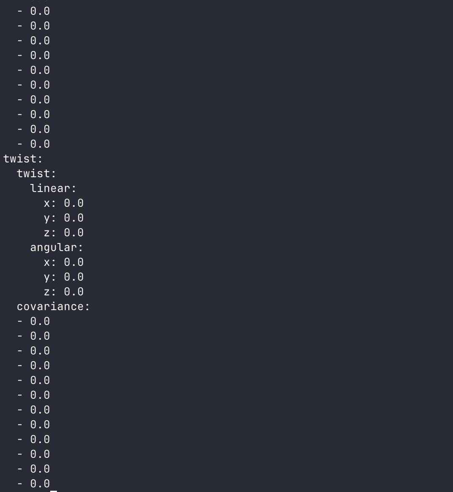
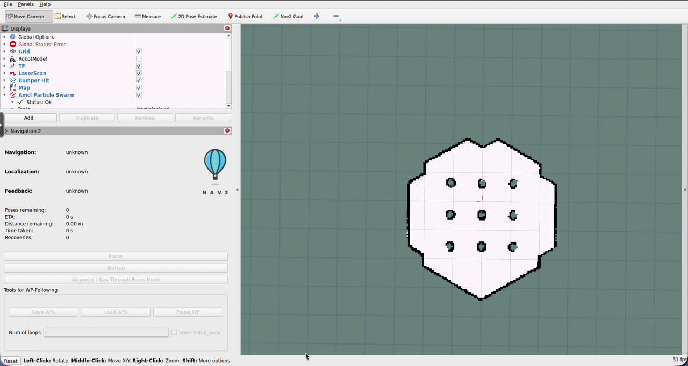

# ROS 2 Assignment: Autonomous Navigation with Nav2

---

## Brief from Your Manager

Hey, welcome to the robotics team!

We're about to deploy our robot in a new location and we need it to navigate autonomously (no driver in the loop). The plan is straightforward: first we map the space, then we point the robot at a destination and let Nav2 figure out how to get there.

Here's what we need from you:

- **Use the simulation** to go through the full workflow so you understand it before we touch the physical robot
- **Build a map** of the simulated environment using SLAM
- **Launch the navigation stack** with that map and get the robot moving autonomously
- **Send it a goal** and confirm it actually arrives

You'll be using two of Nav2's most important tools: **SLAM Toolbox** for mapping and **AMCL** for localisation during navigation. Take your time to understand what each piece is doing, as this workflow is exactly what you'll repeat on real hardware.

Good luck, and ask if anything's unclear!

---

## Overview

Before starting, launch the robot simulation in one of your tmux panes:

```bash
ros2 launch linorobot2_gazebo gazebo.launch.py spawn_x:=0.5
```

Wait until Gazebo has fully loaded and the robot is visible in the browser before proceeding.


In this assignment you will:

1. Inspect the robot's coordinate frame tree (TF) to understand how sensor data is connected to the robot body
2. Explore the base controller topics to see how the robot receives movement commands and reports its position
3. Understand how odometry and sensor fusion work together to give Nav2 a reliable position estimate
4. Visualize the LIDAR sensor data in RViz to confirm the sensor is working
5. Build a map of the simulated environment by driving the robot with SLAM Toolbox
6. Save the map to disk
7. Launch the Nav2 navigation stack with your saved map
8. Set an initial pose estimate so AMCL can localise the robot
9. Send autonomous navigation goals and observe the robot plan and execute a path
10. Use `rqt_graph` to verify all nodes are connected correctly

---

## 1. The Robot's Coordinate Frame Tree

Before writing any code or launching any stacks, it pays to understand the spatial relationships between the robot's frames. In ROS 2 this is managed by **TF2** (a library that tracks every named coordinate frame in the system and lets any node ask "what is the transform between frame A and frame B right now?").

### 1.1 Why coordinate frames matter

Every sensor reading is expressed in the sensor's own frame. The laser scanner reports distances from the `laser` frame's origin. The odometry tracks position in the `odom` frame. For the navigation stack to work, it needs to know exactly where each frame sits relative to the others, otherwise it cannot project a laser scan onto a map or plan a path relative to the robot's body.

### 1.2 Inspect the TF tree

With the simulation running, generate a snapshot of the current TF tree:

```bash
ros2 run tf2_tools view_frames
```

This creates a PDF called `frames.pdf` in the current directory. Open it to see the full tree.

Below is an example of what the frames look like in RViz when the robot is running:


You should see a tree that looks like this:

```
map
└── odom
    └── base_footprint
        └── base_link
            └── laser
```

Each edge in the tree is a **transform** (a combination of translation and rotation that describes how one frame relates to its parent). Here is what publishes each edge:

| Transform | Published by | Description |
|-----------|-------------|-------------|
| `map -> odom` | SLAM Toolbox (during mapping) or AMCL (during navigation) | Robot's global position in the map |
| `odom -> base_footprint` | `robot_localization` EKF node | Odometry-based position estimate |
| `base_footprint -> base_link` | `robot_state_publisher` | Static: floor plane to robot body |
| `base_link -> laser` | `robot_state_publisher` | Static: robot body to laser sensor |

> **Note:** When you first launch the simulation without SLAM or navigation running, the `map -> odom` transform does not exist yet. That is expected, as it will appear once you start SLAM or Nav2.

### 1.3 Inspect a specific transform

You can also check a single transform in real time. Try querying the relationship between `base_link` and `laser`:

```bash
ros2 run tf2_ros tf2_echo base_link laser
```

You should see the static offset (the physical position of the laser relative to the robot's centre). Press `Ctrl+C` to stop.

---

## 2. The Base Controller: How the Robot Moves

The base controller is the bridge between the ROS 2 world and the robot's wheels. Understanding the topics it exposes gives you visibility into how commands flow in and how position estimates flow out. Both are essential ingredients for autonomous navigation.

### 2.1 Sending velocity commands with /cmd_vel

The robot listens for movement instructions on the `/cmd_vel` topic. Any node that wants to move the robot (a teleoperation tool, a navigation planner, or your own code) simply publishes a `geometry_msgs/msg/Twist` message here.

A `Twist` message carries two vectors:
- `linear.x` sets the forward/backward speed in metres per second
- `angular.z` sets the rotation rate in radians per second

Check that the topic is active:

```bash
ros2 topic info /cmd_vel
```

Now start keyboard teleoperation and watch the topic come alive:

```bash
ros2 run teleop_twist_keyboard teleop_twist_keyboard
```

In a second terminal, echo the topic while you press keys:

```bash
ros2 topic echo /cmd_vel
```

Press `i` to move forward and `j` to turn left. You should see the `linear.x` and `angular.z` values change as you press different keys. Press `k` to stop and notice the values return to zero.

> **Why this matters for navigation:** During autonomous operation, Nav2's local controller publishes to `/cmd_vel` continuously, adjusting speed and steering to follow the planned path. The robot does not care who published the command, it simply executes whatever `Twist` message arrives.

### 2.2 Reading raw odometry with /odom/unfiltered

While the wheels are turning, the base controller tracks how far each wheel has rotated and integrates that into a position estimate. This is called **dead reckoning**: estimating where you are based purely on how far you have travelled from a known starting point.

This raw estimate is published to `/odom/unfiltered` as a `nav_msgs/msg/Odometry` message.

Drive the robot forward a short distance with teleop and echo the topic to see it update:

```bash
ros2 topic echo /odom/unfiltered
```



The key fields to notice are:

| Field | Description |
|-------|-------------|
| `pose.pose.position.x` | Estimated X position in metres from the start point |
| `pose.pose.position.y` | Estimated Y position in metres from the start point |
| `pose.pose.orientation` | Estimated heading as a quaternion |
| `twist.twist.linear.x` | Current forward velocity |
| `twist.twist.angular.z` | Current rotation rate |

Drive the robot in a rough square and watch the position values change. When you return to approximately the starting point, check whether `position.x` and `position.y` are close to zero again.

> **What dead reckoning cannot do:** Wheel odometry accumulates error over time. Wheel slip, surface irregularities, and small mechanical differences between wheels all cause the position estimate to drift. This is why raw odometry alone is not enough for long-distance autonomous navigation, and why we add sensor fusion in the next section.

### 2.3 Verify the publish rate

The base controller (and Gazebo's simulated equivalent) publishes odometry at 50 Hz. Confirm this:

```bash
ros2 topic hz /odom/unfiltered
```

You should see approximately 50 Hz. A much lower rate can indicate a problem with the simulation or hardware setup.

---

## 3. Odometry and Sensor Fusion (EKF)

Raw wheel odometry drifts. The robot also carries an IMU (inertial measurement unit) that independently measures rotational velocity. Neither sensor is perfect on its own, but fusing them together using a **Kalman filter** gives a significantly better position estimate. This fused estimate is what Nav2 actually uses.

### 3.1 What robot_localization does

The `robot_localization` package runs an **Extended Kalman Filter (EKF)** that continuously combines:
- Wheel odometry from `/odom/unfiltered` (linear velocity and heading)
- IMU data from `/imu/data` (rotational velocity)

It publishes the fused result to `/odom`, which is the topic Nav2, SLAM Toolbox, and AMCL all consume. It also publishes the `odom -> base_footprint` transform that you saw in the TF tree.

### 3.2 The EKF configuration file

Open the configuration file to see how the fusion is set up:

```bash
cat ~/linorobot2_ws/src/linorobot2/linorobot2_base/config/ekf.yaml
```

The key parameters are:

```yaml
frequency: 50.0          # Filter runs at 50 Hz
two_d_mode: true         # Robot moves on a flat plane (ignores roll/pitch)
publish_tf: true         # Publishes the odom -> base_footprint transform

map_frame: map
odom_frame: odom
base_link_frame: base_footprint
world_frame: odom

odom0: odom/unfiltered   # Wheel odometry input
imu0: imu/data           # IMU input
```

The `odom0` and `imu0` lines tell the filter which topics to read. Below each of those entries there is a matrix that specifies which components of each sensor to trust. For wheel odometry this is typically the linear velocities; for the IMU this is typically the yaw (rotation) rate.

> **FYI, you do not need to edit this file for the exercise.** It is worth reading once to understand what is happening under the hood. On a physical robot you would tune these values to match the actual noise characteristics of your hardware.

### 3.3 Compare raw and filtered odometry

With the simulation running and teleoperation active, echo both topics side by side in separate terminals:

```bash
# Terminal A
ros2 topic echo /odom/unfiltered

# Terminal B
ros2 topic echo /odom
```

Drive the robot and observe both streams. The values will be similar in simulation (since Gazebo's physics is clean), but on physical hardware the filtered `/odom` is noticeably smoother and more consistent.

### 3.4 Why this matters for autonomous navigation

Nav2 needs a reliable, continuous stream of position data to:
1. Keep track of where the robot is between LIDAR scans
2. Feed the local controller so it can adjust `/cmd_vel` at high frequency
3. Provide the `odom -> base_footprint` transform that anchors the whole TF tree

Without a properly functioning EKF, navigation will be erratic or fail to start entirely. If you ever see Nav2 reporting that it cannot find the robot's position, the EKF is the first place to check.

---

## 4. Visualize the LIDAR Sensor

With the motion and odometry pipeline understood, confirm the LIDAR is publishing data before building a map. This is the same sanity check you will want to do on physical hardware before trusting any higher-level system.

### 4.1 Find the LIDAR topic

List all active topics and look for the laser scan:

```bash
ros2 topic list -t
```

Find the topic with type `sensor_msgs/msg/LaserScan`. On this robot it is `/scan`.

Confirm data is flowing:

```bash
ros2 topic echo /scan --once
```

You should see a message with a large `ranges` array, one distance reading per ray in the 360° sweep.

### 4.2 Visualize in RViz

Launch RViz:

```bash
rviz2
```

Once open, configure the display:

1. In the **"Fixed Frame"** field (top-left panel), type:
   ```
   base_footprint
   ```

2. Click **"Add"** (bottom-left), select the **"By topic"** tab

3. Find `/scan` in the list, select the **LaserScan** display type, and click **OK**

You should now see a ring of coloured dots surrounding the robot, representing the distances measured in every direction.


> **What you are looking at:** Each dot is one ray from the spinning laser. The dot's distance from the robot centre represents how far away the nearest surface is in that direction. Walls and objects appear as clusters of dots at their actual positions. This is the raw data that SLAM and Nav2 will use.

Move an object close to the robot in Gazebo and watch the scan update in real time. If you can see the dots react, your sensor is working correctly.

---

## 5. Build a Map with SLAM

Now that the sensor is confirmed, it is time to build a map. **SLAM Toolbox** runs Simultaneous Localisation and Mapping: it matches each incoming laser scan against the map built so far, gradually filling in the environment while tracking where the robot is.

### 5.1 Launch SLAM

In a new terminal, launch SLAM Toolbox with RViz enabled:

```bash
ros2 launch linorobot2_navigation slam.launch.py sim:=true rviz:=true
```

You should see RViz open with a mostly grey occupancy grid. The grey areas are **unknown space** (the robot hasn't scanned them yet). As you drive the robot around, the grey will fill in with white (free space) and black (obstacles/walls).

> **Tip:** If you see `slam_toolbox: Message Filter dropping message: frame 'laser'` in the terminal, it means TF transforms are not arriving fast enough. This is typically harmless in simulation but indicates a timing issue on physical hardware.

### 5.2 Drive the robot to build the map

In a new terminal, start keyboard teleoperation:

```bash
ros2 run teleop_twist_keyboard teleop_twist_keyboard
```

Use the following keys to control the robot:

| Key | Action |
|-----|--------|
| `i` | Move forward |
| `,` | Move backward |
| `j` | Turn left |
| `l` | Turn right |
| `k` | Stop |
| `q` / `z` | Increase / decrease speed |

Drive the robot slowly around the entire simulated environment. Your goal is to cover every room, corridor, and corner. Watch the map build up in RViz as you go.


**Tips for a good map:**
- Drive **slowly**, as fast movement reduces scan-matching accuracy and introduces drift
- Cover the entire area, including dead ends
- When you return to a previously visited area, SLAM performs **loop closure** (it recognises the familiar scan and corrects any accumulated drift), which is what keeps large maps accurate
- The map quality you get here directly affects navigation quality later

### 5.3 Save the map

Once you are happy with the map, save it to the maps directory:

```bash
cd ~/linorobot2_ws/src/linorobot2/linorobot2_navigation/maps
ros2 run nav2_map_server map_saver_cli -f my_map --ros-args -p save_map_timeout:=10000.
```

This creates two files:

| File | Contents |
|------|---------|
| `my_map.yaml` | Map metadata: resolution, origin coordinates, path to the image |
| `my_map.pgm` | Occupancy grid image: white = free, black = obstacle, grey = unknown |

You can open `my_map.pgm` in any image viewer to inspect the map visually.

> **Note:** Stop the SLAM launch and teleoperation before proceeding to navigation, as SLAM and Nav2 cannot run at the same time because they both try to publish the `map -> odom` transform.

---

## 6. Launch Autonomous Navigation

With the map saved, you can now hand the map to **Nav2**. Nav2 loads the static map, runs **AMCL** to localise the robot within it, and uses a combination of a global path planner and a local controller to drive the robot to any goal you set.

### 6.1 Restart the simulation (clean state)

Stop any running nodes and relaunch Gazebo:

```bash
ros2 launch linorobot2_gazebo gazebo.launch.py spawn_x:=0.5
```

### 6.2 Launch Nav2 with your map

In a new terminal, launch the navigation stack:

```bash
ros2 launch linorobot2_navigation navigation.launch.py \
  map:=$HOME/linorobot2_ws/src/linorobot2/linorobot2_navigation/maps/my_map.yaml \
  sim:=true rviz:=true
```

RViz will open showing the robot on the saved map. You will likely see warning messages in the navigation terminal, which is normal. Nav2 is waiting for an initial pose estimate before it can localise the robot.

> **Why is this necessary?** AMCL uses a **particle filter**: it maintains hundreds of hypotheses about where the robot might be. Without a starting point, those particles are scattered randomly across the entire map. Once you give it an initial pose, the particles converge on the correct location.

### 6.3 Set the initial pose estimate

In RViz, click **"2D Pose Estimate"** in the toolbar at the top.

Then:
1. Click on the map at the location where the robot is currently sitting in Gazebo
2. Hold the mouse button and drag in the direction the robot is facing
3. Release to confirm



After setting the pose you should see:
- The laser scan (red dots) snap into alignment with the walls on the map
- The warning messages in the navigation terminal stop
- A set of green arrows appear around the robot (these are AMCL's **particles**, all now clustered near the estimated position)

> **If the scan doesn't align:** The initial pose was set at the wrong position or orientation. Click "2D Pose Estimate" again and try with a more accurate click and drag. Orientation matters, so drag in the direction the robot's front is pointing.

### 6.4 Confirm localisation with a TF check

Once the initial pose is set, the `map -> odom` transform should now exist. Verify it:

```bash
ros2 run tf2_ros tf2_echo map base_footprint
```

If this prints a transform (translation + rotation) rather than an error, AMCL is successfully localising the robot. Press `Ctrl+C` to stop.

---

## 7. Send Navigation Goals

With the robot localised, you can now send it to any point on the map autonomously.

### 7.1 Send a goal from RViz

In RViz, click **"2D Goal Pose"** in the toolbar.

Then:
1. Click on the map at the desired destination
2. Hold and drag in the direction you want the robot to be facing when it arrives
3. Release to send the goal


After setting the goal you should see:
- A green path drawn from the robot's current position to the goal (this is the **global plan**)
- The robot begin to move, following the path
- The path update in real time as the robot moves and re-plans around any obstacles

### 7.2 What Nav2 is doing

While the robot is moving, several components are working together:

| Component | Role |
|-----------|------|
| **AMCL** | Continuously updates the robot's position estimate as new scans arrive |
| **Global Planner** | Computes the optimal path to the goal using the static map |
| **Local Controller** | Generates `/cmd_vel` commands to follow the path while reacting to nearby obstacles |
| **Global Costmap** | Inflates obstacles on the static map so the planner keeps the robot safely away from walls |
| **Local Costmap** | Maintains a real-time window of sensor data around the robot for immediate obstacle avoidance |
| **Behaviour Tree** | Orchestrates everything, triggering replanning if the robot gets blocked and executing recovery behaviours if needed |

### 7.3 Try multiple goals

Send the robot to several different locations around the map. Observe:

- How it handles corners and narrow gaps
- Whether it replans when it cannot follow the original path
- How it decelerates and aligns when approaching the final goal orientation

> **Default goal tolerance:** Nav2 considers the goal reached when the robot is within **35 cm** of the target position. You can adjust this in `linorobot2_navigation/config/navigation.yaml`.

### 7.4 Monitor the active topics

While navigation is running, check what Nav2 is publishing:

```bash
ros2 topic echo /cmd_vel
```

You should see a continuous stream of velocity commands (this is the local controller driving the robot). When the robot reaches its goal and stops, the stream should go silent.

You can also watch the robot's estimated position update in real time:

```bash
ros2 topic echo /odom
```

---

## 8. Verify with rqt_graph

With the full navigation stack running, use `rqt_graph` to confirm all the nodes and topics are connected as expected.

### 8.1 Launch rqt_graph

```bash
rqt_graph
```

### 8.2 What to look for

You should see the major nodes connected through their topics, roughly like this:

```
[/gazebo] --/scan--> [/amcl]
[/gazebo] --/odom/unfiltered--> [/ekf_filter_node] --/odom--> [/controller_server]
[/bt_navigator] --/cmd_vel--> [/gazebo]
```

Key things to confirm:

- `/scan` is flowing from Gazebo into the navigation nodes
- `/odom` (the filtered output from `robot_localization`) is being consumed by Nav2
- `/cmd_vel` is being published by the local controller and consumed by the simulated base

> **Tip:** Use the dropdown at the top of rqt_graph to toggle between different views. "Nodes/Topics (active)" is the most useful view for debugging, as it hides inactive topics and shows only what is currently publishing.

If a node is missing from the graph, it means it either isn't running or has crashed. Use `ros2 node list` and `ros2 topic list` in the terminal to diagnose.

---

## Completion Checklist

Before calling this done, make sure you can tick everything off:

- [ ] Gazebo simulation launched with the robot spawned
- [ ] TF tree inspected with `ros2 run tf2_tools view_frames` (all frames present: `map`, `odom`, `base_footprint`, `base_link`, `laser`)
- [ ] `/cmd_vel` topic echoed while using teleoperation and velocity commands observed changing
- [ ] `/odom/unfiltered` topic echoed and dead reckoning position values observed updating
- [ ] `ekf.yaml` file opened and sensor fusion inputs (`odom0`, `imu0`) identified
- [ ] `/odom` (filtered) topic echoed and compared alongside `/odom/unfiltered`
- [ ] LIDAR data visualized in RViz with `base_footprint` as the fixed frame
- [ ] SLAM launched and map built by driving the robot around the environment
- [ ] Map saved to `linorobot2_navigation/maps/my_map.yaml` and `my_map.pgm`
- [ ] Navigation stack launched with the saved map
- [ ] Initial pose estimate set in RViz (laser scan aligns with the map walls)
- [ ] `ros2 run tf2_ros tf2_echo map base_footprint` returns a valid transform (not an error)
- [ ] At least two navigation goals sent from RViz (robot reaches both destinations)
- [ ] `/cmd_vel` topic goes silent when the robot reaches the goal
- [ ] `rqt_graph` shows `/scan`, `/odom`, and `/cmd_vel` connected across the correct nodes

---

## References

- [linorobot2 Documentation](https://linorobot.github.io/linorobot2/)
- [Nav2 Documentation](https://docs.nav2.org/)
- [SLAM Toolbox](https://github.com/SteveMacenski/slam_toolbox)
- [robot_localization (EKF)](https://docs.ros.org/en/jazzy/p/robot_localization/)
- `ros2 run tf2_tools view_frames` generates a PDF of the full TF tree
- `ros2 run tf2_ros tf2_echo <parent> <child>` inspects a specific transform in real time
- `ros2 run nav2_map_server map_saver_cli` saves the current SLAM map to disk
- `rqt_graph` visualizes node and topic connections
- `ros2 topic list -t` lists all active topics with their types
- `ros2 topic hz <topic>` checks the publish rate of a topic
